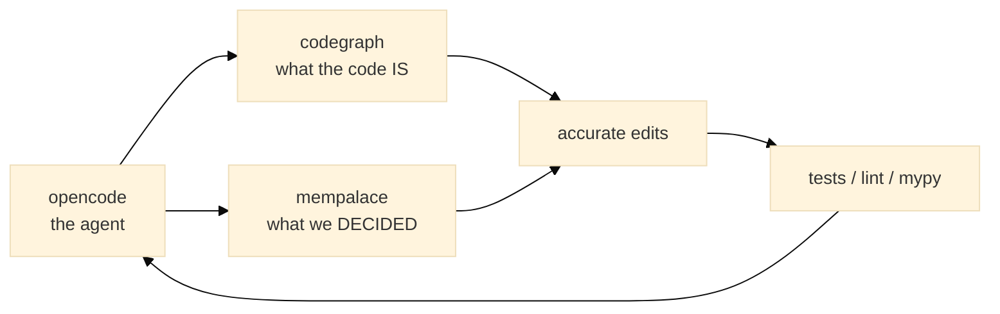
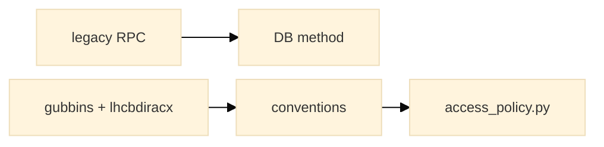
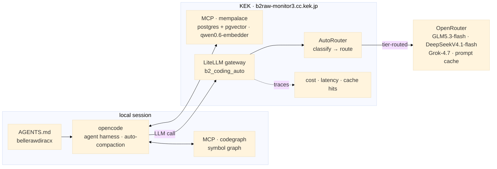
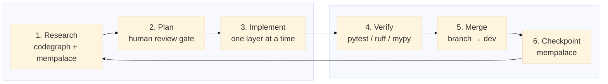

# AI-Assisted Code Porting
## BelleRawDIRAC → DiracX with opencode, codegraph & mempalace

**Dhiraj Kalita**

 

DIRACx User's Workshop 2026

<a href="https://gitlab.desy.de/belle2/computing/distributed-computing/developments/bellerawdiracx" class="ns-c-iconlink"><mdi-open-in-new />bellerawdiracx on GitLab</a>

---
layout: section
color: diracx
title: context
---

# Context

---
layout: top-title
color: diracx-light
align: cm
title: legacy
---

:: title ::

# The Legacy: BelleRawDIRAC

:: content ::

**BelleRawDIRAC** is a DIRAC extension (Belle II) implementing the raw-data
registration and replication workflow: the `B2RawDataManagementSystem`.

| Component | Role |
|-----------|------|
| `Service/B2RawDataRegistrationHandler` | 22 `export_*` RPCs, the public API |
| `DB/B2RawRegistrationDB` | MySQL/InnoDB schema + business logic |
| `Agent/*` | 9 agents (registration, upload, transfer, …) |
| `Client/scripts/*` | 11 `b2dirac-raw-*` argparse commands |
| `Utilities/manager.py`, `util.py` | Grid upload + LFC/AMGA/Rucio plumbing |
| `Resources/Catalog/RucioFileCatalogClient` | Rucio-backed file catalogue |

<AdmonitionType type='note' >
The whole extension predates DiracX and is built on the DIRAC framework's RPC/DB idioms.
</AdmonitionType>

---
layout: top-title
color: diracx-light
align: cm
title: target
---

:: title ::

# The Target: DiracX + `bellerawdiracx`

:: content ::

**DiracX** is the modern re-architecture of DIRAC: FastAPI routers, SQLAlchemy
databases, a generated client, and a Typer CLI. Third-party functionality lives
in **extension** packages.

`bellerawdiracx` is the Belle II raw-data extension, laid out as a monorepo:

| Package | Responsibility |
|---------|----------------|
| `bellerawdiracx-db` | SQLAlchemy schema + data access |
| `bellerawdiracx-routers` | FastAPI endpoints + access policy |
| `bellerawdiracx-logic` | Business logic shared by routers/tasks |
| `bellerawdiracx-core` | Configuration / settings |
| `bellerawdiracx-client` | Generated HTTP client |
| `bellerawdiracx-cli` | Typer command group |
| `bellerawdiracx-api` / `-testing` | API wiring + test helpers |

---
layout: section
color: diracx-green
title: problem
---

# The Problem

---
layout: top-title
color: diracx-light
align: cm
title: why-hard
---

:: title ::

# Why a Port Is Hard for an LLM Alone

:: content ::

- **It is not one repository.** The answer lives across the legacy code
  (`BelleRawDIRAC`), its framework (`DIRAC`), the target (`diracx`), and
  `lhcbdiracx` — LHCb's production DiracX extension, used here as the
  reference implementation of the extension pattern.
- **Conventions are implicit — and strict.** An extension plugs in only via
  `pyproject.toml` entry points — `diracx.dbs.sql` (DB), `diracx.services`
  (routers), `diracx.access_policies`, `diracx.cli` — none of which appear
  in the legacy code. The `gubbins` skeleton is the only supported template.
- **Behaviour must be identical.** Error messages, status enums and output
  formatting are part of the contract with running agents.
- **It spans sessions.** No single context window survives a multi-session,
  week-long port.

<AdmonitionType type='important' >
An LLM without structured repository knowledge invents methods and modules
that do not exist and forgets the plan between sessions.
</AdmonitionType>

---
layout: section
color: diracx
title: toolchain
---

# Toolchain

---
layout: top-title
color: diracx-light
align: cm
title: toolchain-overview
---

:: title ::

# Three Tools, One Loop

:: content ::

- **opencode** — the agent orchestrating research, edits and verification
- **codegraph** — a queryable knowledge graph of every indexed repository
- **mempalace** — durable, searchable memory of every session and decision

---
layout: top-title
color: diracx-light
align: cm
title: codegraph
---

:: title ::

# codegraph: Structured Repository Knowledge

:: content ::

Instead of grep-and-pray, every repository is parsed into a graph of symbols,
calls, imports and inheritance.

| Capability | What it answers |
|-----------|-----------------|
| `search_graph` | Where is this symbol? What looks like this? (semantic + name) |
| `trace_path` | Who calls this? What does it call? |
| `get_architecture` | Packages, entry points, dependencies, layers, cycles |
| `detect_changes` | What did this diff touch, and what does it impact? |
| cross-repo | Follow a call into another indexed repository |

<AdmonitionType type='note' >
Crucially it is <strong>multi-repo</strong>: the legacy code, the upstream
framework and other DiracX extensions all live in one graph — finding how a
similar problem was already solved becomes a simple query.
</AdmonitionType>

---
layout: top-title
color: diracx-light
align: cm
title: indexed-projects
---

:: title ::

# The Graph We Actually Indexed

:: content ::

Six projects, interconnected, for this one port:

| Project | Role |
|---------|------|
| **BelleRawDIRAC** | the legacy source (behaviour spec) |
| **bellerawdiracx** | the target |
| **diracx** | upstream framework + `extensions/gubbins` example |
| **DIRAC** | the legacy framework |
| **lhcbdiracx** | LHCb's DiracX extension (production implementation of the pattern) |
| **diracx-charts** | deployment |

<AdmonitionType type='important' >
Upstream gives the <strong>conventions</strong>; a real extension like
<code>lhcbdiracx</code> gives the <strong>production version</strong> of the
same pattern; the legacy gives the <strong>behaviour</strong>.
</AdmonitionType>

---
layout: top-title
color: diracx-light
align: cm
title: codegraph-in-practice
---

:: title ::

# codegraph in Practice

:: content ::

- **Find upstream conventions** — how `gubbins` registers a DB, a service and
  an access policy via entry points.
- **Port the DB layer** — the legacy `B2RawRegistrationDB` (4 tables, status
  enums, ~20 methods) mirrored 1:1 into the `bellerawdiracx-db` schema.
- **Port the service** — all 22 legacy `export_*` RPCs traced to their DB
  methods before writing the 19 endpoints.
- **Find a real extension implementation** — `lhcbdiracx`'s access policy
  mirrored into `bellerawdiracx/routers/access_policy.py`.
- **Review our own diff** — `detect_changes` before merging.

---
layout: top-title
color: diracx-light
align: cm
title: mempalace
---

:: title ::

# mempalace: Memory That Outlives the Context

:: content ::

A semantic memory of sessions, decisions and plans — searchable by meaning.

- **Recall a previous session** — "what did we agree last time?"
- **Resume a phase** — "what is the next phase?"
- **Keep the plan** — the phased roadmap survives week-long gaps.
- **Cross-agent handoff** — decisions recorded while working in one repo are
  available when the work moves to another.

<AdmonitionType type='note' >
codegraph answers <em>what the code is</em>; mempalace answers <em>what we
already decided</em>. Neither alone is enough.
</AdmonitionType>

---
layout: top-title
color: diracx-light
align: cm
title: mempalace-in-practice
---

:: title ::

# mempalace in Practice

:: content ::

Real recall moments from the port:

> "recall the last session" → *(returns the DB/routers/client/CLI status and
> exactly what was left)*

> "what is the next phase" → *"Phase 3 (client codegen) is done; next is
> Phase 4 — port the 11 `b2dirac-raw-*` scripts to Typer."*

> "what is left to be done" → *(dependency-ordered TODO: routers → logic →
> core → client → CLI)*

This is why a multi-week port could resume each day without re-deriving state.

---
layout: top-title
color: diracx-light
align: cm
title: llm-side
---

:: title ::

# The LLM Side: LiteLLM AutoRouter

:: content ::

An LLM-as-classifier (`GLM5.3-flash`) labels each task, then the **LiteLLM
gateway's AutoRouter** sends it to the cheapest model that can do the job:

| Task tier | Model |
|-----------|-------|
| simple | `GLM5.3-flash` |
| medium | `DeepSeekV4.1-flash` |
| complex | `DeepSeekV4.1-flash` · reasoning effort: high |
| reasoning | `Grok-4.7` |

- **~$9.50 total** for the whole port — multiple sessions across one week.
- **OpenRouter prompt caching** kept repeated context (repos, graphs) cheap.
- **opencode harness** + automatic context compaction kept long sessions lean.

<AdmonitionType type='note' >
<strong>mempalace on-site</strong> — postgres + pgvector, the
<code>qwen0.6-embedder</code> for indexing and retrieval, exposed over MCP:
one session per codebase, memories searchable across codebases. Hosted on a
remote server at <strong>KEK</strong>, behind the same LiteLLM gateway.
</AdmonitionType>

---
layout: top-title
color: diracx-light
align: cm
title: e2e-flow
---

:: title ::

# End-to-End: One Agent Call

:: content ::

- **AGENTS.md** + **MCP** (codegraph local; mempalace on pgvector at KEK) shape
  every prompt.
- Each model call passes through the **LiteLLM gateway**; **AutoRouter** picks
  the cheapest capable model per task tier.
- **Traces** log cost and latency; **OpenRouter** prompt caching keeps repeated
  context cheap.

---
layout: section
color: diracx-green
title: workflow
---

# The Workflow

---
layout: top-title
color: diracx-light
align: cm
title: loop
---

:: title ::

# The Porting Loop

:: content ::

No step was skipped: every phase was planned in read-only mode and explicitly
approved before a single edit.

**Verify on the real cluster** — the agent was given access to the **k3s**
deployment to run the service and exercise the endpoints directly, not only
against unit tests.

---
layout: top-title
color: diracx-light
align: cm
title: guardrails
---

:: title ::

# Guardrails

:: content ::

| Guardrail | Purpose |
|-----------|---------|
| **Plan mode** | Research and propose before editing; human approves |
| **Tests as contract** | Legacy behaviour encoded as pytest assertions |
| **ruff + mypy** | Style and type gates in CI |
| **Branch per phase** | `db-`, `router-`, `client-`, `cli-porting`, merged `--no-ff` |
| **Parity with defaults** | Legacy defaults, enums and message strings preserved |
| **Small diffs** | One layer at a time keeps review tractable |

<AdmonitionType type='important' >
The agent writes the code; the human owns the plan and the merge.
</AdmonitionType>

---
layout: section
color: diracx
title: results
---

# Results

---
layout: top-title
color: diracx-light
align: cm
title: timeline
---

:: title ::

# Phase Timeline (2026)

:: content ::

| Date | Branch | What landed |
|------|--------|-------------|
| Sep 10 | `db-porting` | SQLAlchemy schema + data access (4 tables) |
| Sep 17 | — | CI: lint, mypy, wheels, buildah images |
| Sep 25 | `router-porting` | Access policy + real router tests + build gating |
| Sep 25 | `client-porting` | Regenerated client from OpenAPI, client tests |
| Sep 25 | `cli-porting` | 11 scripts → `b2rawregistration` Typer group |
| Sep 28 | `like-query-porting` | `use_like_query` support end-to-end |
| Sep 28 | — | Production validation of server side + CLI |

---
layout: top-title
color: diracx-light
align: cm
title: deep-dive-db
---

:: title ::

# Deep Dive 1 — Database

:: content ::

Legacy MySQL schema → DiracX SQLAlchemy conventions.

- 4 tables: `Files`, `Datablocks`, `Datasets`, `GlobalTag` — hierarchy
  `Dataset → Datablock → Files` enforced in Python (legacy foreign keys
  were commented out: "they don't work").
- Statuses were plain Python lists in the legacy module, enforced only in
  application code — the DB had bare `VARCHAR(100)` columns → now typed
  `StrEnum`s per hierarchy level: `FileStatus` (file lifecycle),
  `MinorStatus` (pipeline step, doubles as operation claim), `DBStatus`
  (**D**ata**b**lock + Dataset states).
- The legacy `metadata` column collides with SQLAlchemy's reserved attribute,
  so the column stays `metadata` while the Python attribute is `metadata_txt`.
- Legacy quirks were **documented, not silently "fixed"** (duplicate `size`
  key definition, unsigned ints).

<AdmonitionType type='note' >
The port is explicitly a 1:1 faithful translation; design clean-ups are
deferred.
</AdmonitionType>

---
layout: top-title
color: diracx-light
align: cm
title: deep-dive-routers
---

:: title ::

# Deep Dive 2 — Service → Routers

:: content ::

The 22 legacy `export_*` RPCs became **19 HTTP endpoints**, with many-to-one
merges where the RPC split was an artifact of the RPC layer:

| Endpoint | Absorbs |
|----------|---------|
| `POST /entries` | `setFilesToRegister`, `initDatablock`, `initDataset`, `addGlobalTagInfo` |
| `PATCH /datablocks` | `initDatablock`, `updateDatablocksInfo` |
| `PATCH /datasets` | `initDataset`, `updateDatasetsInfo` |
| `POST /files/prepare-operation` | `getFilesForOperation` (read + state transition) |

<AdmonitionType type='important' >
<code>prepare-operation</code> needs a process-level lock: query-and-claim
must be atomic, otherwise two callers grab the same files.
</AdmonitionType>

---
layout: top-title
color: diracx-light
align: cm
title: deep-dive-client-cli
---

:: title ::

# Deep Dive 3 — Client & CLI

:: content ::

**Client** — `bellerawdiracx-client` is **generated** from the routers' OpenAPI
schema. We never hand-write HTTP calls.

**CLI** — the 11 `b2dirac-raw-*` argparse scripts became one Typer group,
`dirac b2rawregistration`, preserving legacy output formatting 1:1:

| Legacy script | New command |
|---------------|-------------|
| `b2dirac-raw-setToRegister` | `set-to-register` |
| `b2dirac-raw-getFilesStatus` | `get-files-status` |
| `b2dirac-raw-completeDataset` | `complete-dataset` |
| `b2dirac-raw-summary` | `summary` |
| … (11 total) | … |

<AdmonitionType type='note' >
<code>printFieldsTable</code>, <code>printErrorsTable</code> and summary
formatting were ported so operators see no change.
</AdmonitionType>

---
layout: top-title
color: diracx-light
align: cm
title: deep-dive-ci
---

:: title ::

# CI/CD Modernization

:: content ::

Porting the code also meant porting the *pipeline*:

- **Lint + type gates** — ruff and mypy run on every push.
- **Test gating** — docker images and wheel publication only after tests pass.
- **Wheels to registry** — dynamic `setuptools_scm` versions, SPDX licenses.
- **Container build** — a **pixi** environment (`container-services`) built with
  **buildah**, needing no privileged runner.
- **Build gating** — images only on `dev` and tags.

<AdmonitionType type='note' >
The same agent that read the legacy code also read the legacy CI and proposed
the new <code>.gitlab-ci.yml</code>.
</AdmonitionType>

---
layout: top-title
color: diracx-light
align: cm
title: bridge
---

:: title ::

# Closing the Loop: Zero-Downtime Migration

:: content ::

The new backend could not be switched on all at once, so the legacy **client**
was swapped for DIRAC's future-client adapter:

- `BelleRawDIRAC/.../FutureClient/RawDataRegistrationClient.py` subclasses
  DIRAC's `FutureClient` and exposes all 22 legacy `export_*` methods, each
  forwarding to `client.b2_rawregistration.*` with the **caller's own
  credentials** (`DiracXClient`) — no server-side forwarding handler.
- `ClientSelector` instantiates it in place of the DISET `RPCClient` when
  `/DiracX/FutureClientEnabled/B2RawDataManagement/B2RawDataRegistration` is
  enabled (read via `PathFinder.useLegacyAdapter`).
- Running agents keep working unchanged during rollout.

<AdmonitionType type='important' >
The port is only "done" when old clients, new clients and agents can coexist.
</AdmonitionType>

---
layout: top-title
color: diracx-light
align: cm
title: k3s-deployment
---

:: title ::

# Deployment on k3s

:: content ::

---
layout: top-title
color: diracx-light
align: cm
title: lessons
---

:: title ::

# Lessons Learned

:: content ::

- **Graph > grep.** Structured repository knowledge stopped the agent
  inventing methods and modules that do not exist; multi-repo indexing turned
  finding how similar problems were already solved into a simple query.
- **Memory > context.** Persisting plans and decisions across sessions is what
  made a multi-week port feasible.
- **Humans own the plan.** Plan-mode review was the highest-leverage step.
- **Tests are the spec.** Encoding legacy behaviour as tests is what let the
  agent move fast safely.

---
layout: top-title
color: diracx-light
align: cm
title: remaining
---

:: title ::

# Limitations & Remaining Work

:: content ::

**Limitations**

- WRITE permission checks in the access policy are still a TODO.
- The prepare-operation lock is process-local (single-pod assumption).

**Remaining**

1. `bellerawdiracx-logic` — port `Utilities/manager.py` + `util.py`.
2. `bellerawdiracx-core` — `RawPath` / `HLTPath` settings, `RucioFileCatalogClient`.
3. Agents → DiracX tasks, where available.
4. Production rollout and decommissioning of the legacy path.

---
layout: section
color: diracx-green
title: summary
---

# Summary

---
layout: top-title-two-cols
color: diracx-light
align: cm-cm-lm
columns: is-3
title: summary-slide
---

:: title ::

# Summary

:: left ::

 </img>

:: right ::

- **AI + codegraph + mempalace** ported a DIRAC extension to DiracX
- **codegraph** delivered accurate, multi-repo knowledge
- **mempalace** delivered continuity across a multi-week effort
- **Plan → implement → verify → merge** kept a human in control
- **22 RPCs → 19 endpoints**, 4 tables, 11 CLI commands, all green
- **Zero-downtime** rollout via the impersonating legacy adapter

---
layout: credits
color: diracx
loop: true
speed: 1.4
title: credits
---

    

        <strong>Author</strong> 
    

    

        Dhiraj Kalita <i>KEK (JP), Belle II</i> 
    

    

        <strong>Built with</strong> 
    

    

        opencode · codegraph · mempalace 
        Slidev + neversink theme
    

&nbsp;
&nbsp;
&nbsp;
